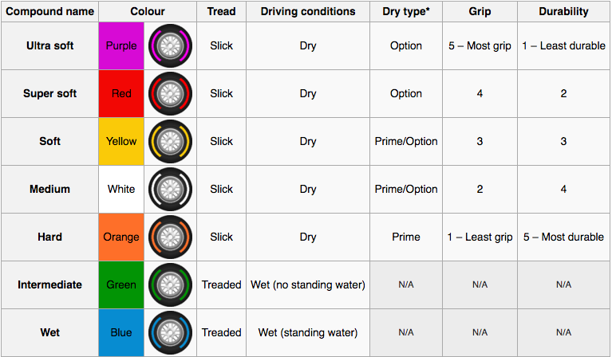
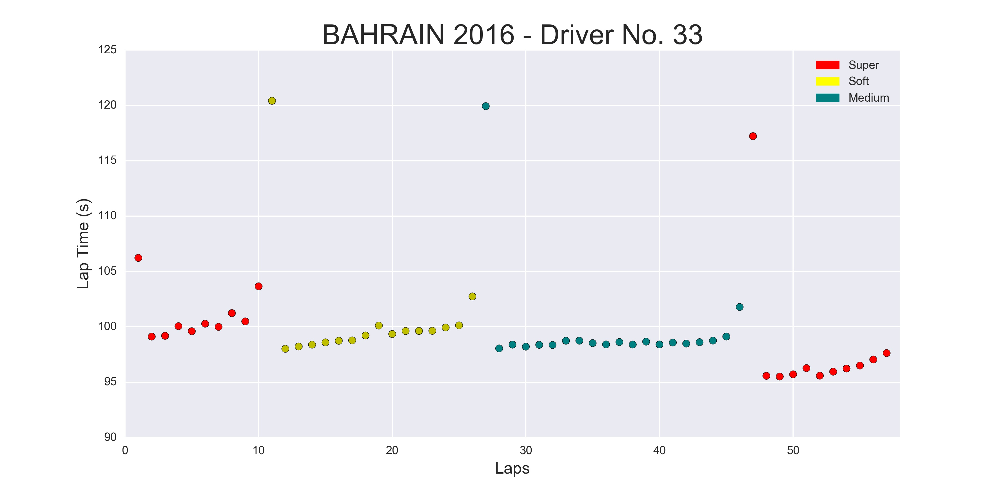
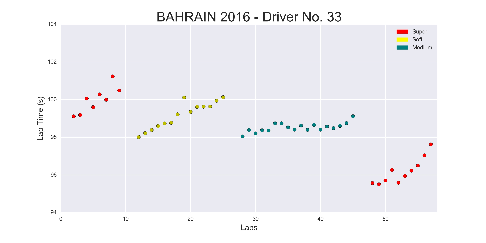
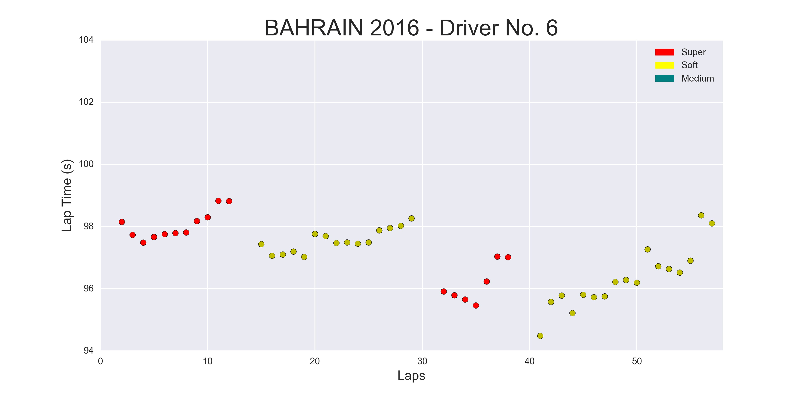
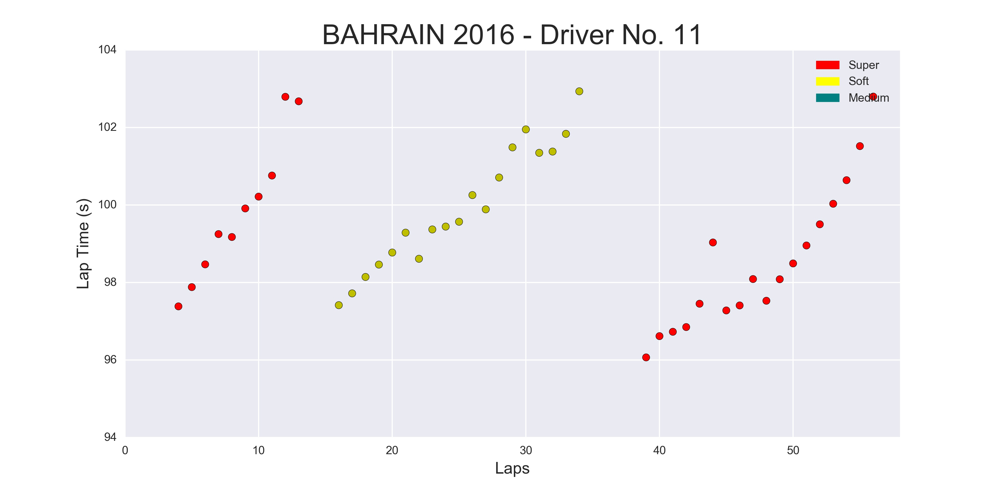
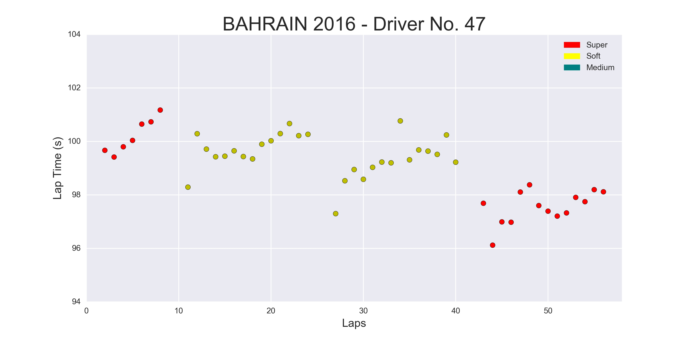
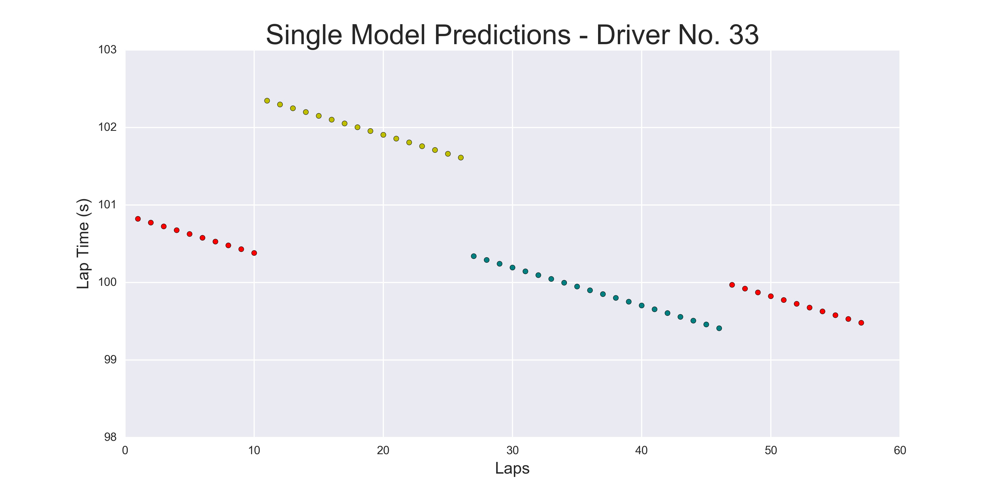
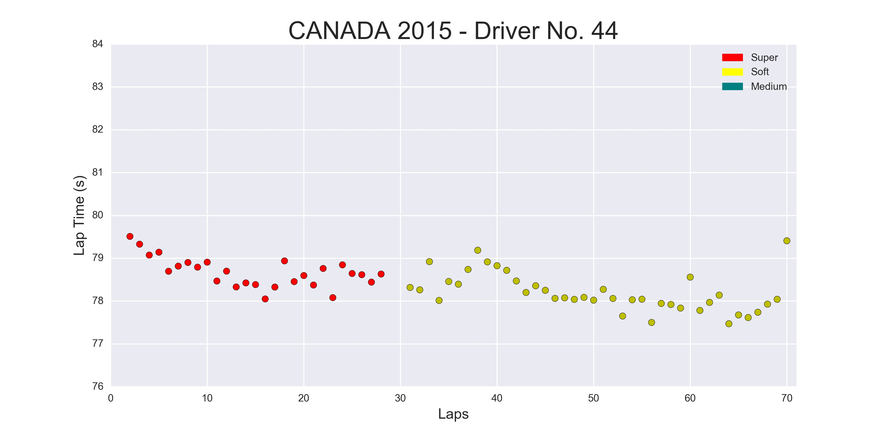
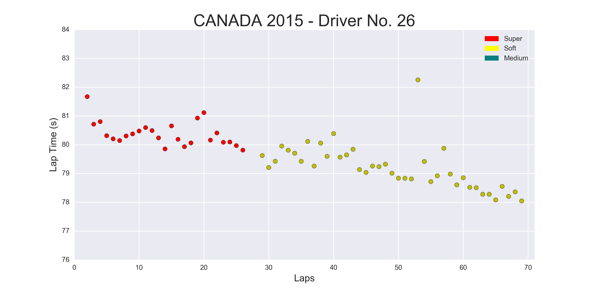
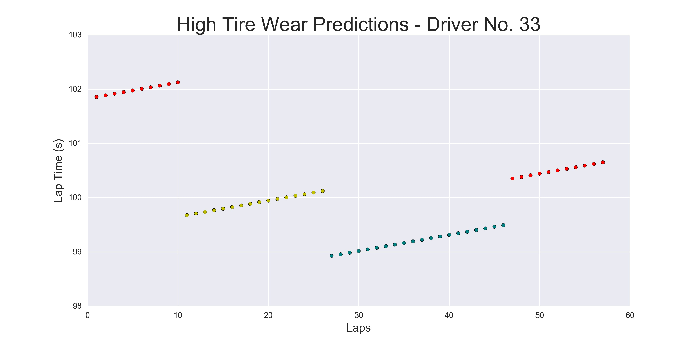

# Overview

The goal of my project was to predict the best tire strategy for an upcoming Formula 1 race. Below is a table of the available tires and their characteristics for the 2016 season. Teams have the choice from a set of tires with varying performance factors for each race. A good strategy will balance the speed and wear of the tires with the cost in time needed to change tires in an effort to produce the optimal race result. Using historical timing data from past races, circuit information, and environmental factors, I have built a model that can predict lap times. Given certain domain knowledge about an upcoming race, a user can feed the model a set of tire strategies and the model will predict the winning strategy.

### 2016 Tire Regulations

Under the current rules for the 2016 season, Pirelli designates three dry types of tires to be used for each Grand Prix based on the circuit. Drivers are to use at least two of the dry weather compound tires during the race.  

In the above table, Grip is analogous with speed and Durability is inversely analogous with wear, meaning the fastest tire wears out most quickly.  

# Data Collection & Preprocessing

I scraped lap time, pitstop, maximum speed, sector time, and qualifying time data from the [FIA](http://www.fia.com/events/fia-formula-one-world-championship/season-2016/2016-fia-formula-one-world-championship) for all drivers in every race for the 2015 season and the ongoing 2016 season.  This data will allow me to model general trends such as tire wear that will be common among all races.  

I also scrapped circuit features, environmental data, and tires used for each lap from the tire manufacturer, [Pirelli](http://www.pirelli.com/tires/en-us/motorsport/formula-one/tire-range), to complement the data I gather from the FIA. The track features and the environmental data are key in allowing me to predict lap times of future races. For each track, Pirelli has assigned a value from 1-5 in the following categories:
* Downforce
* Lateral Force
* Asphalt Abrasion
* Asphalt Grip
* Tire Stress

 These features along with track length, air temperature, and track temperature, allows me to not only relate lap times on circuits with geographically different features, but also lap times on the same circuit year over year.

Unfortunately, both the FIA data and Pirelli data were not in machine readable formats.  The FIA data was tabulated in PDF format and the Pirelli data was a set of infographics in JPG format. I chose to use Tabula to convert the PDFs into CSV format through a mostly automated process. Due to the quality of some of the tables in the PDF, I had to write a post processing script to fix errors from the conversion process.  Not having a similar solution for the data trapped in JPG format, I chose to scrape the tire data from the [f1fanatic](http://www.f1fanatic.co.uk/2016/04/03/2016-bahrain-grand-prix-tyre-strategies-and-pit-stops/) blog and write a small script to unpack the drivers' strategy for each race. Because there were only 20+ circuits on the Formula 1 calendar and having no other source for data, I chose to build the track features data set by hand. The finally step in data collection was to create a set of drivers that participated in either the 2015 or 2016 seasons.

# Modeling

Given the data I had available, I set out to build a regression model that could predict a lap time for any lap in a given race, on a given tire.

### EDA & Data Cleaning

Plotting lap times vs. lap was a natural place to start exploring that data. The following graph shows the lap times of Max Verstappen, \#33, in the 2016 Bahrain Gran Prix. Data points are color coded by the type of tire used to set the lap time.

Already we can see several trends in the data. For each stint on a new tire, we see that the lap time increase slight as the laps increase from the tire change. This is an expected trend in the data due to Pirelli's description of the tires. The slightly slower lap time at the end of each stint and the unusually slow lap time at the start of each new stint can be attributed to the time it take to preform a pit stop and change the tires.  For now these laps, will be excluded when training the linear regression model for predicting lap times, along with the slow first lap which can be attributed to the a standing start as well as traffic as the starting grid falls into place on the racing line.  These times will be modeled separately and incorporated back into the Race Simulation later to calculate a final race time for a particular strategy. Finally, laps raced under classified crash events when the safety car is on track will also be thrown out, since they will be artificially slow and it is impossible to reasonably predict crash events.  Below is a cleaned version of Max Verstappen's race in Bahrain, along with a select few drivers from the same race:

We can see that there is a range in strategy among just these four drivers. There are different tire choices, different orders to use tires, and different even different pit stop strategies, with one driver choosing to only change tires two times instead of the more common 3 times.

Another particularly subtle, but important trend is that lap times decrease overall as the race goes on.  This trend can be attributed to the fact that all drivers start the race with a fixed amount of fuel at 100 kg.  As the race goes on and fuel is burned, the cars get lighter, thus achieving superior lap times.  

Joining the now clean lap time data with the environmental and track feature data, I have a feature matrix that I can use to predict lap times of future Grand Prix.

### Model Training & Predictions

I used python's statsmodels library to train a OLS liner regression model to predict lap times.  I created a feature STINT_LAP which signifies the number of laps driven since the most recent tire change, in order to incorporate tire wear for that particular lap.  I also used dummy variables for each tire type to get a piece wise linear fit for each stint.  I also explored using interaction features such as LAPS^2, and STINT_LAP^s to fit a more complex model to the, but this proved no significant, so I dropped all interaction terms.

After some initial tuning and feature engineering, I was able to train a model that produced and R^2 value of 0.80 on a hold out test set. Which is not bad considering the variability of the data.  But, when plotting the predicted values, I did not see the expected increase in laps times of the course of a particular stint that is attributed to tire wear.

It appears that the model is not accounting for tire wear at all.  After another round of exhaustive EDA, I discovered that there are two class of Grand Prix, High Tire Wear and Low Tire wear.  High tire wear I expected to see, and which I have shown in multiple visualizations. However, the low tire wear class show no tire ware trends from stint to stint.

I was able to identify and label races that clear showed this trend, and train a Logistic Regression model to split the data into two classes.  I only used track features and environmental data to train the logistic regression model, for 2 reasons:
    1. Using the timing and lap data seemed like potential source of leakage
    2. This model will eventually need to be generative when it is incorporated into the race simulation

Now, I am feeding the data into the logistic regression model to subset it, then training separate linear regression models for each class. In doing so, I was able to achieve the following R^2 scores:

    * High Tire Wear: R^2 = 0.85
    * Low Tire Wear: R^2 = 0.97

# Conclusions

It turns out that of all Grand Prix, approximately 30%  fall into the Low Tire Wear class, 60% into the High Tire Wear class, with 10% as edge cases.  Due to the way I trained the logistic regression model and the high R^2 score, I believe I am getting a very pure Low Tire Wear class and most, if not all, edge cases are ending up in the High Tire Wear class. This leads me to believe that I can improve upon R^2 = 0.85 by tuning the logistic regression step.  Plotted below are lap time predictions made using the new multiclass model.

The predicted values from the High Tire Wear model now show the tire wear trends that I expect to see based on my initial EDA.  The predicted lap times for the soft tire are a bit higher that expected, but I imagine with a bit a tuning and an improved R^2 score, these predictions will get better.

### Next Steps

1. Tune logistic regression step  

Upon further EDA, it looks like the two most important factors in identifying Low Tire Wear Grand Prix are cool temperatures and low downforce. I would like to train the model to include an increasing amount of the edge cases using these parameters and the pick the threshold the maximizes the R^2 score of both the High and Low tire wear models.

2. Complete Race Simulator

I have coded the framework of a simulation class.  Once I am happy with the lap time predictions, I plan to complete the Simulator.  The user will be able to give the Simulator a range of strategies, and applying statistical modeling, it will choose the strategy that minimizes the total race time.

3. Create Live Dashboard

I plan to host the simulator on an EC2 instance with a dashboard that shows the optimal race strategy and also gives users the ability to test out the own race strategy theories.

## References:
* http://www.fia.com/
* http://www.pirelli.com/tyres/en-ww/motorsport/homepage
* https://en.wikipedia.org/wiki/Formula_One_tyres
